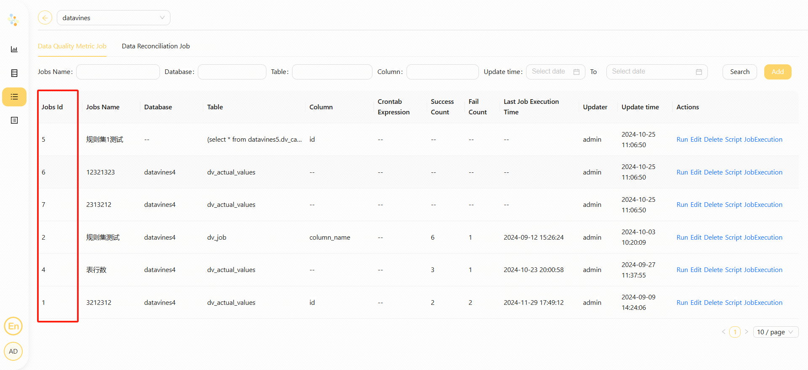

# Datavines

## Overview

Use `Datavines Task` to create a datavines-type task and support data quality job in Datavines. When the worker executes `Datavines Task`,
it will call `Datavines API` to trigger datavines job. Click [here](https://datavane.github.io/datavines-website/) for details about `Datavines`.

## Create Task

- Click Project Management-Project Name-Workflow Definition, and click the "Create Workflow" button to enter the DAG editing page.
- Drag  from the toolbar to the canvas.

## Task Parameter

- Please refer to [DolphinScheduler Task Parameters Appendix](appendix.md) `Default Task Parameters` section for default parameters.

|   **Parameter**   |                                            **Description**                                            |
|-------------------|-------------------------------------------------------------------------------------------------------|
| Datavines Address | The URL for the Datavines service, e.g., http://localhost:5600.                                       |
| Datavines Job ID  | The unique job id for a datavines job.                                                                |
| Datavines token   | The Datawines service access token can be obtained through token management on the Datavines service. |
| Block on Failure  | When turned on, if the data quality check result is failed, the task result will be set as failed.    |

## Task Example

This example illustrates how to create a datavines task node.

