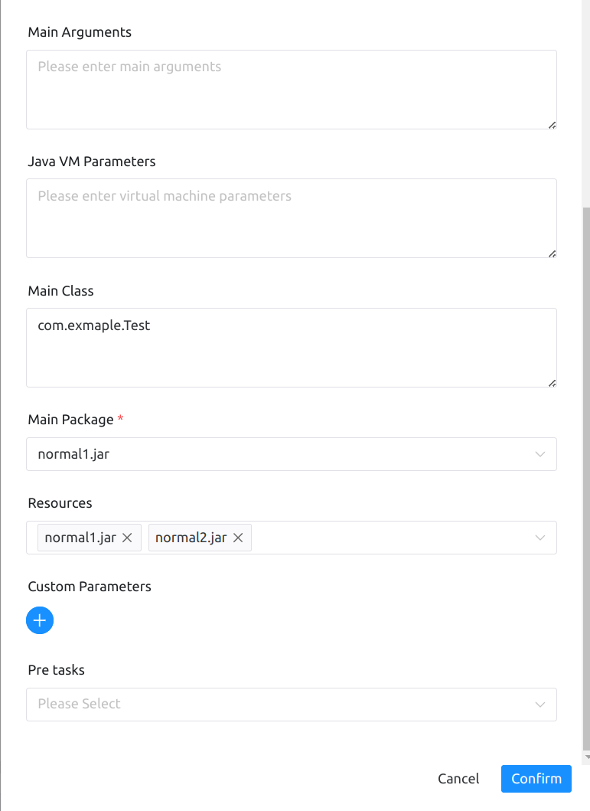

# Overview

This node is used to execute tasks of the `Java` type and supports running `jar` packages of the `FAT_JAR` and `NORMAL_JAR` types.

# Create Tasks

- Click on `Project Management` -> `Project Name` -> `Workflow Definition`, click on the “Create workflow” button, go to the DAG edit page:

- Drag the toolbar's Java task node to the palette.

# Task Parameters

[//]: # (TODO: use the commented anchor below once our website template supports this syntax)
[//]: # (- Please refer to [DolphinScheduler Task Parameters Appendix]&#40;appendix.md#default-task-parameters&#41; `Default Task Parameters` section for default parameters.)

- Please refer to [DolphinScheduler Task Parameters Appendix](appendix.md) `Default Task Parameters` section for default parameters.

|   **Parameter**    |                                                                **Description**                                                                |
|--------------------|-----------------------------------------------------------------------------------------------------------------------------------------------|
| Module Path        | pick Java 9 + 's modularity feature, put all resources into-module-path, and require that the JDK version in your worker supports modularity. |
| Main Parameter     | Java program main method entry parameter.                                                                                                     |
| Java VM Parameters | JVM startup parameters.                                                                                                                       |
| Main Class Name    | Fully Qualified Name of the Main Class (Optional)                                                                                             |
| Main Package       | Select the main program package to run the application.                                                                                       |
| Resources          | External JAR packages or other resource files that are added to the classpath or module path and can be easily retrieved in your JAVA script. |

## Example

There are two execution modes for Java task types, which will be demonstrated separately here.

The main configuration parameters are as follows:
- Run Type
- Module Path
- Main Parameters
- Java VM Parameters
- Main Package
- Resources

As shown in the figure.

- FAT_JAR

`FAT_JAR` is also known as `uber-jar`, where the dependencies and code are contained within the same `jar`. You only need to select this one `jar`.

- NORMAL_JAR

`normal1.jar` is the entry point of the program, and `normal2.jar` contains the required dependencies. The entry point of the program must be specified in the main program package, and all the dependencies along with the program entry `jar` files should be selected in the resource file to ensure correct execution.

## Note

1. For security reasons, when executing JAVA tasks, please use the environment management module to configure the JDK environment, such as `JAVA_HOME` and other environment variables.
2. NORMAL_JAR should provide the main class name (optional), while FAT_JAR does not need to provide the main class name.

