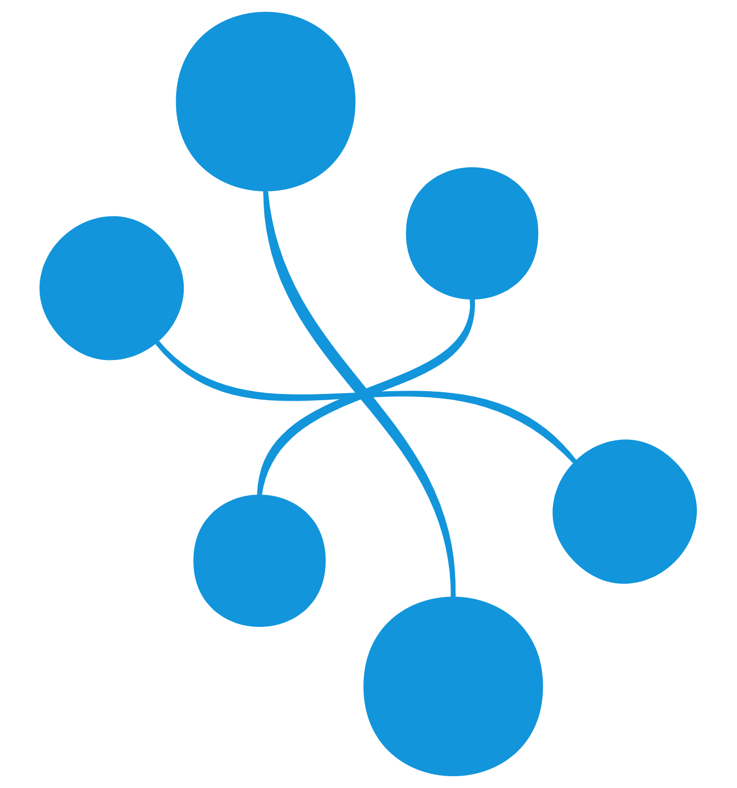
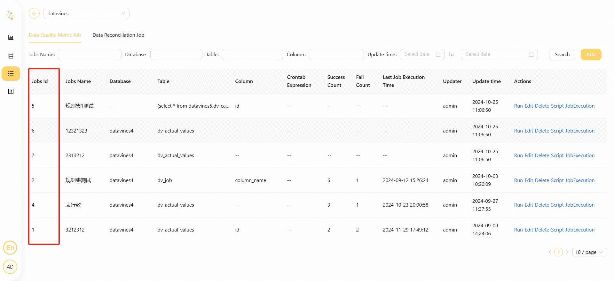

# Datavines

## 综述

`Datavines`任务类型，用于创建并执行 `Datavines` 类型任务来执行 Datavines 中的数据质量检查作业。Worker 执行该任务的时候，会通过 `Datavines API` 触发 `Datavines 的作业`。
点击 [这里](https://datavane.github.io/datavines-website/) 获取更多关于 `Datavines` 的信息。

## 创建任务

- 点击项目管理-项目名称-工作流定义，点击"创建工作流"按钮，进入DAG编辑页面。
- 工具栏中拖动  到画板中，即可完成创建。

## 任务参数

- 默认参数说明请参考[DolphinScheduler任务参数附录](appendix.md)`默认任务参数`一栏。

|    **任务参数**     |                        **描述**                        |
|-----------------|------------------------------------------------------|
| Datavines 地址    | Datavines 服务的 url，例如：`http://localhost:5600`。        |
| Datavines 作业 ID | Datavines 作业对应的唯一ID。                                 |
| Datavines token | Datavines 服务访问 token, 可在 Datavines 服务上的 token 管理中取得。 |
| 检查失败时阻塞         | 开启时，数据质量检查结果为失败时会将任务结果置为失败。                          |

## 例子

这个示例展示了如何创建 Datavines 任务节点：

