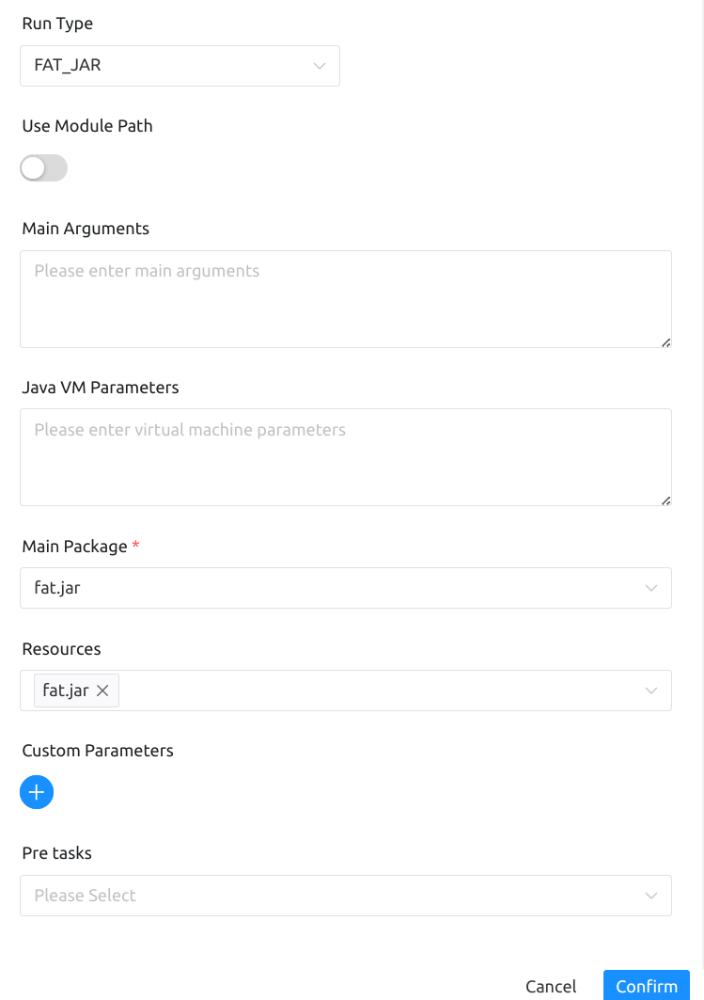
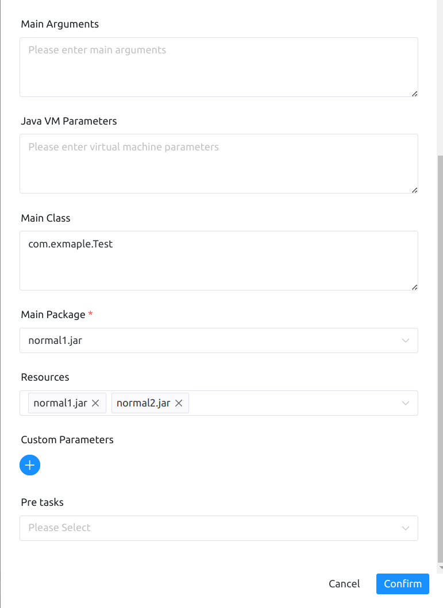

# JAVA 节点

## 综述

该节点用于执行`Java`类型的任务，支持使用`FAT_JAR`类型和`NORMAL_JAR`类型的`jar`包运行。

## 创建任务

- 点击项目管理 -> 项目名称 -> 工作流定义，点击”创建工作流”按钮，进入 DAG 编辑页面：

- 拖动工具栏的JAVA任务节点到画板中。

## 任务参数

[//]: # (TODO: use the commented anchor below once our website template supports this syntax)
[//]: # (- 默认参数说明请参考[DolphinScheduler任务参数附录]&#40;appendix.md#默认任务参数&#41;`默认任务参数`一栏。)

- 默认参数说明请参考[DolphinScheduler任务参数附录](appendix.md)`默认任务参数`一栏。

| **任务参数** |                            **描述**                             |
|----------|---------------------------------------------------------------|
| 模块路径     | 开启使用JAVA9+的模块化特性，把所有资源放入--module-path中，要求您的worker中的JDK版本支持模块化 |
| 主程序参数    | 作为普通Java程序main方法入口参数                                          |
| 虚拟机参数    | 配置启动虚拟机参数                                                     |
| 主类名      | 启动类的完整主类名(可选)                                                 |
| 主程序包     | 选择要运行程序的主程序包                                                  |
| 资源       | 可以是外部JAR包也可以是其他资源文件，它们都会被加入到类路径或模块路径中，您可以在自己的JAVA脚本中轻松获取      |

## 任务样例

java任务类型有两种运行模式，这里进行分别进行演示。

主要配置参数如下：

- 运行类型
- 模块路径
- 主程序参数
- 虚拟机参数
- 主程序包
- 资源文件

如图所示

- FAT_JAR类型

`FAT_JAR`即`uber-jar`，依赖和代码都在同一个`jar`中，只需选择这一个`jar`即可

- NORMAL_JAR类型

`normal1.jar`是程序运行的入口，`normal2.jar`是所需的依赖，需要用主程序包指定程序的入口，并且在资源文件中选择所有依赖和程序入口的`jar`文件，才能正确运行

## 注意事项

1. 基于安全原因，执行JAVA任务时，请使用环境管理功能配置JDK环境，例如`JAVA_HOME`等环境变量
2. `NORMAL_JAR` 应该提供主类名(可选)，`FAT_JAR` 不需要提供主类名。

